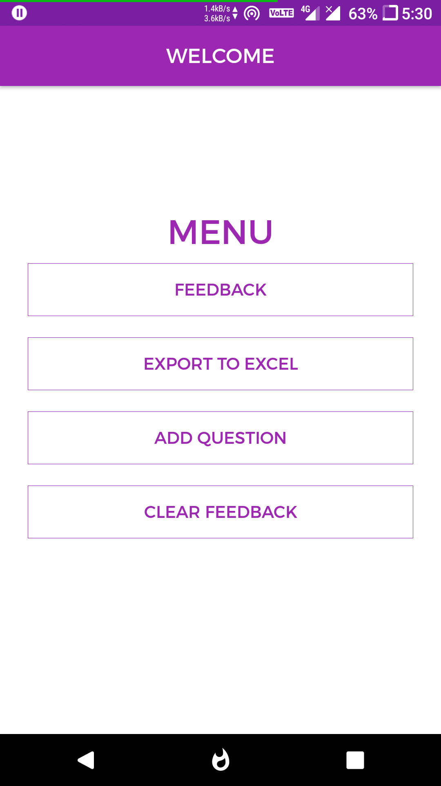
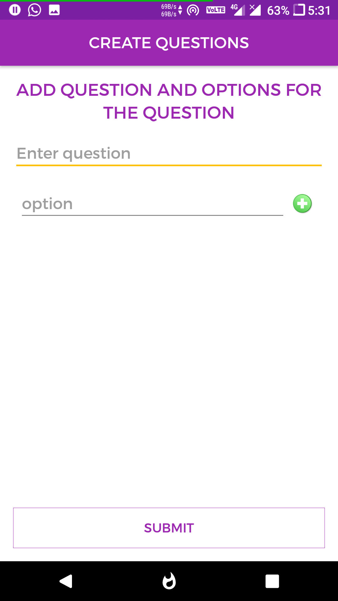
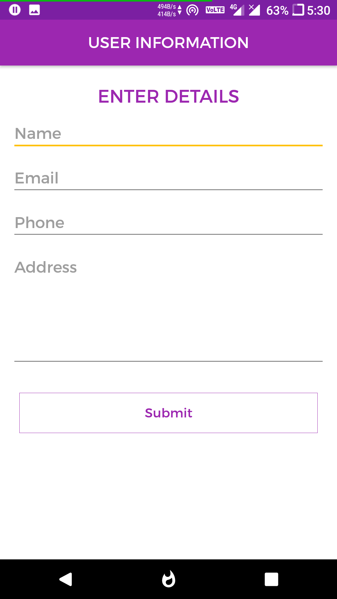

<h2 align="center"><b>General Feedback</b></h2>
<h4 align="center">A generic feedback app, for doing bulk surveys offline.</h4>

## General Feedback

General feedback app is a generic feedback app, which can take any number of multiple choice questions and those questions can be used to take feedbacks from people in the same app.

It will also allow to export all the feedbacks to an excel sheet

## Getting Started

_Follow these instructions to build and run the project.._

1. Clone this repository.
3. [Install Android Studio](https://developer.android.com/sdk/index.html).
5. Import the project. Open Android Studio, click `Open an existing Android
   Studio project` and select the project. Gradle will build the project.
6. Run the app. Click `Run > Run 'app'`. After the project builds you'll be
   prompted to build or launch an emulator.

## Features

* Add any number of questions
* Export all feedback to excel

## Screenshots

   
   
   

## App

      
    

## Contributing Guidelines

Read the contributing guidelines [here](https://github.com/arshadkazmi42/general-feedback/blob/master/CONTRIBUTING.md)

## Contributors

Thank you to all the contributors who help in making this project better :raised_hands:

